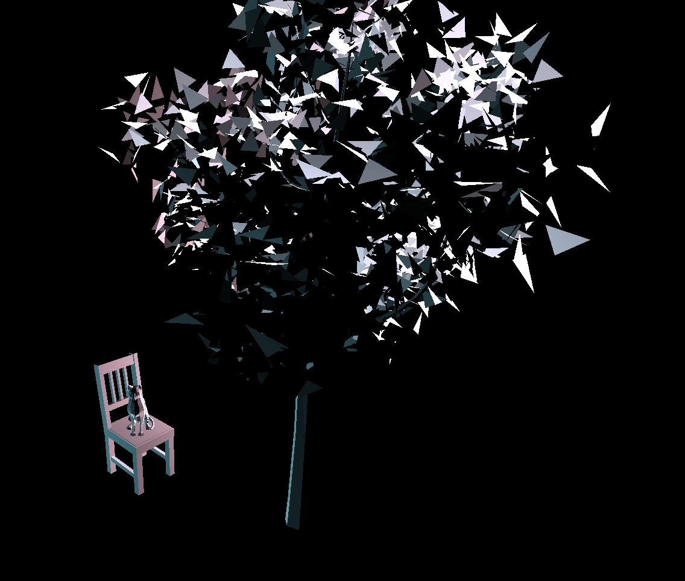
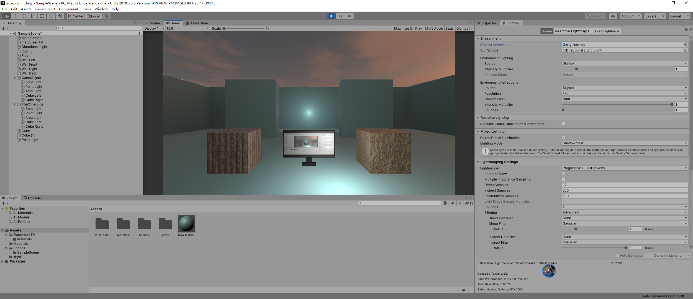
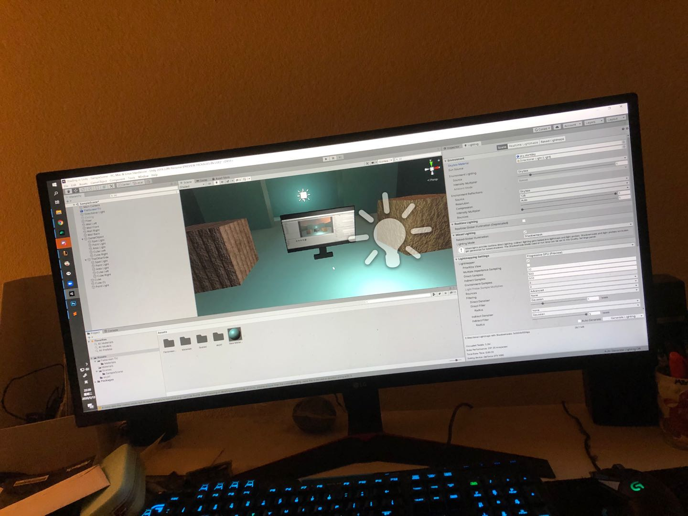
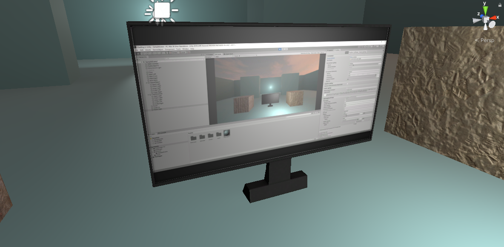
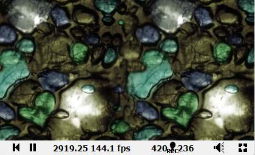

# CMPM163Labs

## lab 2 
video: https://drive.google.com/file/d/1Yputx_ZndWPwKitaMdqliXQzlYU0logU/view?usp=sharing  

  

## lab 3 
video: https://drive.google.com/file/d/1RmkysuQTNaQuMsLh3OI5a7QriIe7MOH5/view?usp=sharing  
-the left cube is pink with blue specular highlight  
-the middle top cube is the cool cube with given fragment shader  
-the middle middle cube is the green specular highlight one  
-the middle bottom cube is the cool rainbow cube with my custom fragment shader  

## lab 4 
video: https://drive.google.com/file/d/1WUOdaT1Vc_z9MmE-sl-0vqD9oYyRH_Ru/view?usp=sharing  
-the middle cube is the Texture A + Normal Map A cube  
-the middle left cube is the Texture A cube  
-the top cube is the Texture B + Normal Map B cube  
-the right cube is shader loaded Texture C cube  
-the botttom cube is the 2x2 shader loaded cube, I took modulo of vUv times 2.0 divided by 1.0 to get it done. To understand this, I treat the factor 2.0 as the 'density' of texture; and when vUv times 2.0 gets out of the bounds, I take the modulo to push the shader back to the origin of the texture  
answer to qustion 24: (rounding up x and y)  
	a)x = u*8-1  
	b)y = 8-v*8  
	c)white  

## lab 5
Part 1: video: https://drive.google.com/file/d/1-rzAUMY-E3t5W_yNgo5r7HJlEpBCcksU/view?usp=sharing  
I have an Audi R8 model used instead of the default kart. I modified the track to make it more challenging. I also changed the sun into blue.  
Part 2:  
video a : https://drive.google.com/file/d/16XQgVeBgnn-NtxUkR9vpT0MdX0D-2SxO/view?usp=sharing  
video b1: https://drive.google.com/file/d/1MaNgxRUTAP-cNg4YP-kWn2S8avZsM1zL/view?usp=sharing  
video b2: https://drive.google.com/file/d/1Z4LeXnCk38HZOvzmFdA5vjRtx-1pinYi/view?usp=sharing  
I made my particles and collapse after they explode.

## lab 6  
Part 1:
  
-A point light is basically an illuminating dot. Spotlight is like the headlight of cars or flashlight. A directional light is a parallel light like the sunlight. An area light is an illuminating area.  
    
-I put the screenshot onto the texture of the monitor mesh to make it look like the real monitor.  
-I put two cubes from lab4 into the scene.  
-The skybox I added is a sunset skybox.  
Part 2:  
  
Link of my shader: https://www.shadertoy.com/view/wsBBzz  
Link of cool shader:  https://www.shadertoy.com/view/3slcWr  

## lab 7  
Part 1:
video: https://drive.google.com/file/d/16mqtLZHNAyMDd6IwKt7_5kiTxBlAdbq4/view?usp=sharing  
I have a sphere with the tutorial shader, a mountain plane with my own shader and texture, a plane wave as water and changed directional light to make the normal texture looks awesome. My most challenging part was to make the mountain plane looks nice. At first it only folds in one axis. What I did to solve this is to split the position of distorted UVs and re-combine that the distortion is based on x and z axies instead of x and y axies. The most interesting part is when I was looking around my mountain plane, I found one direction with the best reflection of the directional/sun light. I changed the direction of the light to make my cemara see that effect.  
Check in with my partner:  
i. Which part did they do?  
Jason: Part 2.  
ii. Which part of a tutorial did your partner find most challenging?  
Jason: I think the most challenging part for mine was just trying to come up with a cool way to do the ocean effects. I didn't really enjoy having to manually setup and import meshes (that part was the most annoying).  
iii. Which part of a tutorial did your partner find most interesting?  
Jason: An interesting part was how I got the waves to look after my second initial run. It looked like you dropped a ball into a pool and the waves kept originating from the center.  
