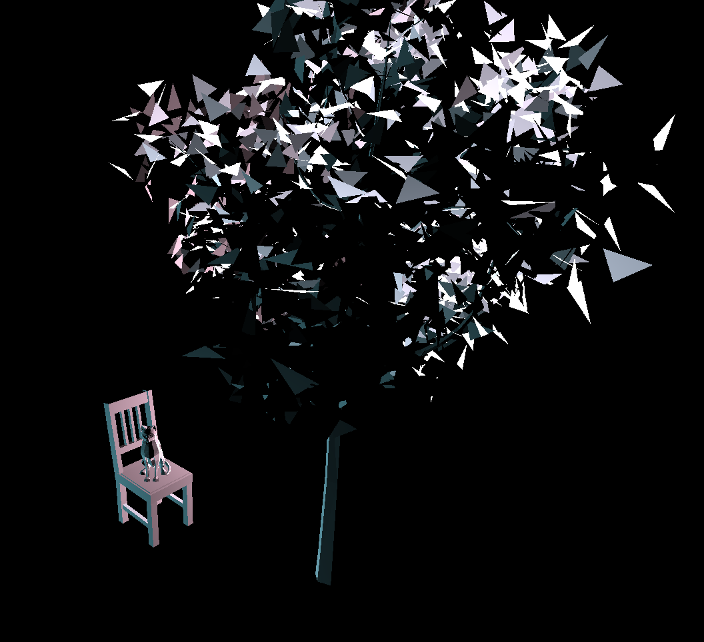

# CMPM163Labs

## lab 2 
video: https://drive.google.com/file/d/1Yputx_ZndWPwKitaMdqliXQzlYU0logU/view?usp=sharing  

  

## lab 3 
video: https://drive.google.com/file/d/1RmkysuQTNaQuMsLh3OI5a7QriIe7MOH5/view?usp=sharing  
-the left cube is pink with blue specular highlight  
-the middle top cube is the cool cube with given fragment shader  
-the middle middle cube is the green specular highlight one  
-the middle bottom cube is the cool rainbow cube with my custom fragment shader  

## lab 4 
video: https://drive.google.com/file/d/1WUOdaT1Vc_z9MmE-sl-0vqD9oYyRH_Ru/view?usp=sharing  
-the middle cube is the Texture A + Normal Map A cube  
-the middle left cube is the Texture A cube  
-the top cube is the Texture B + Normal Map B cube  
-the right cube is shader loaded Texture C cube  
-the botttom cube is the 2x2 shader loaded cube, I took modulo of vUv*2.0 and 1.0 to get it done. To understand this, I treat the factor 2.0 as the 'density' of texture; and when vUv*2.0 gets out of the bounds, I take the modulo to push the shader back to the origin of the texture  
answer to qustion 24: (rounding up x and y)  
	a)x = u*8-1  
	b)y = 8-v*8  
	c)white  